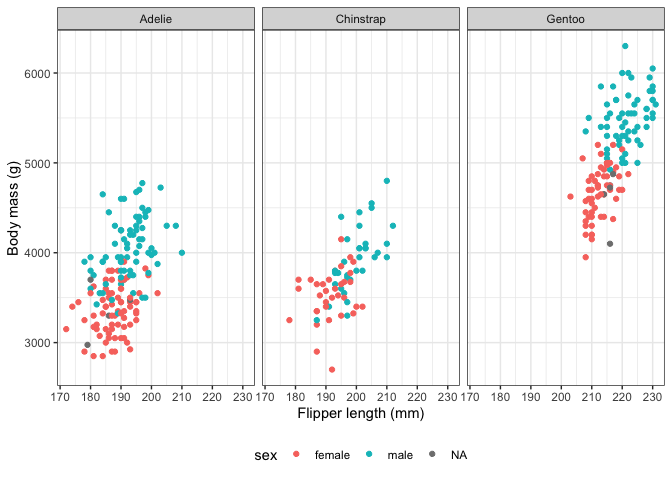

# Exploring Penguin dataset

``` r
package_names <- c("tidyverse", "palmerpenguins")

for (package_name in package_names) {
  if (!requireNamespace(package_name, quietly = T)) {
    install.packages(package_name)
  } else {
    library(package_name, character.only = T)
  }
}
```

``` r
glimpse(penguins)
```

    ## Rows: 344
    ## Columns: 8
    ## $ species           <fct> Adelie, Adelie, Adelie, Adelie, Adelie, Adelie, Adel…
    ## $ island            <fct> Torgersen, Torgersen, Torgersen, Torgersen, Torgerse…
    ## $ bill_length_mm    <dbl> 39.1, 39.5, 40.3, NA, 36.7, 39.3, 38.9, 39.2, 34.1, …
    ## $ bill_depth_mm     <dbl> 18.7, 17.4, 18.0, NA, 19.3, 20.6, 17.8, 19.6, 18.1, …
    ## $ flipper_length_mm <int> 181, 186, 195, NA, 193, 190, 181, 195, 193, 190, 186…
    ## $ body_mass_g       <int> 3750, 3800, 3250, NA, 3450, 3650, 3625, 4675, 3475, …
    ## $ sex               <fct> male, female, female, NA, female, male, female, male…
    ## $ year              <int> 2007, 2007, 2007, 2007, 2007, 2007, 2007, 2007, 2007…

``` r
ggplot(penguins, aes(x = flipper_length_mm, y = body_mass_g, colour = sex)) +
  geom_point() +
  facet_wrap(~species) +
  labs(x = "Flipper length (mm)", y = "Body mass (g)") +
  theme_bw() +
  theme(legend.position = "bottom")
```

<!-- -->
